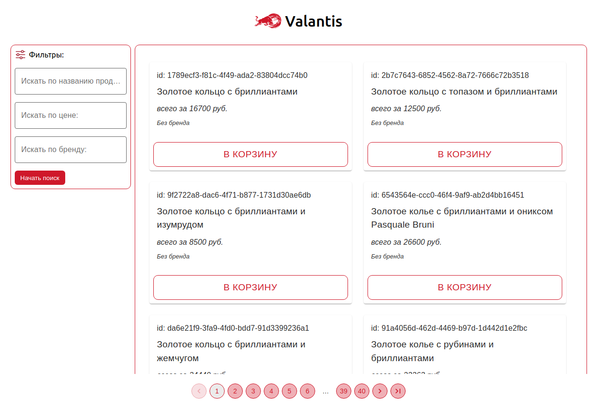

# Valantis Test Task

Тестовое задание для Ювелирного магазина Валантис

## Table of Contents

- [Installation](#installation)
- [Features](#features)
- [Stracture](#stracture)
- [Additional links](#additional)

## Installation

```bash
$ git clone [Repository URL]
$ cd [Project Directory]
$ npm install
$ npm start
```

## Features

- В качестве кастомного цвета был выбран основной цвет Компании Валантис - #cf182a - Ализариновый красный или цвет Пожарной машины
- Для упрощения разработки и экономии времени, для компонентов была выбрана библиотека MUI
- В качестве шортката для TS компонентов был использован самописный кастомный сниппет 'rafcc'
- Для хеширования пароля к АПИ была использовала библиотека md5
- Кнопки на карточках сделаны исключительно для баланса и красоты карточки, они не несут никакого функционала

Превью:


## Stracture

```bach
> src
  > components
    > Card // карточка товара
    > Filters // фильтры
    > Header // хедер с лого
    > ItemsList // Список товаров
    > Pagination // пагинация
    > Snackbar // снекбар при обработке ошибок
  > modules
    > items // слайсы и интерфейсы для товаров
    > redux // стор и редюсеры
  > ui
    > icons // иконки
    > vars // варсы с основным цветом, глобальные стили
```

## Additional

- [Резюме Канивец Любава](https://hh.ru/resume/94f593d8ff0c30b9800039ed1f595a34525456)
- [Дока Валантис](https://github.com/ValantisJewelry/TestTaskValantis/blob/main/API.md)
- [Репозиторий Валантси](https://github.com/ValantisJewelry/TestTaskValantis?tab=readme-ov-file)
- [Material-UI дока](https://mui.com/material-ui/getting-started/)
- [React документация](https://reactjs.org/docs/getting-started.html)
